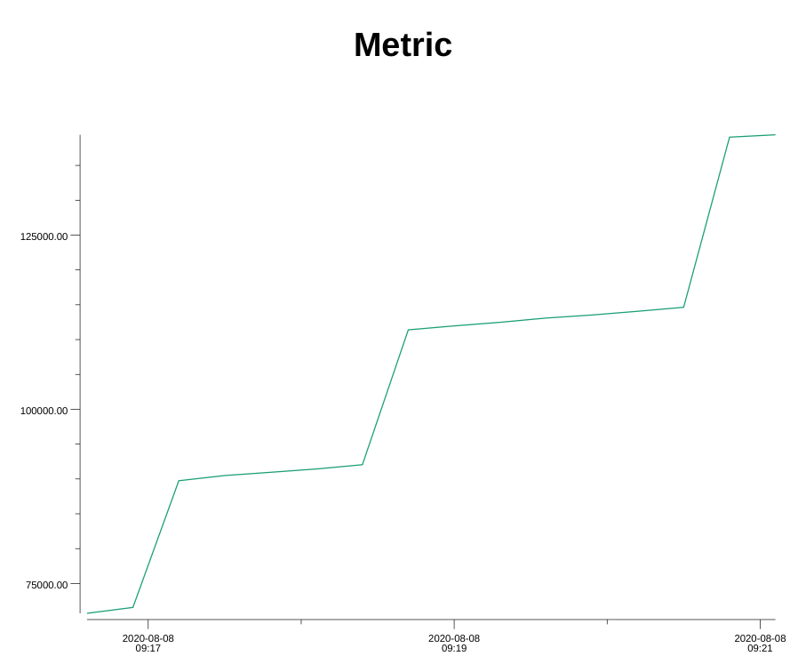

# Prom-plot

`prom-plot` is used for plotting the metrics in prometheus to images.

### Install
- With Go:
```shell script
$ go get -u github.com/siddontang/prom-plot
```
- From Source:
```shell script
$ make build
```

### Usage

```shell script
$ go run cmd/prom-plot/main.go --help
Usage of /tmp/go-build965231989/b001/exe/main:
  -addr string
        Prometheus address (default "http://127.0.0.1:9090")
  -format string
        Output format (default "png")
  -offset value
        Query time offset (default 1h0m0s)
  -output string
        Output file
  -query string
        Query
  -step value
        Query step (default 15s)
  -t value
        Query point time (default Sat Aug  8 17:26:29 CST 2020)
  -title string
        Metric title (default "Metric")
```

### Example

- start prometheus
```shell script
$ docker run --rm -d --name prom -p 9090:9090 prom/prometheus
```

- run this program
```shell script
$ go run cmd/prom-plot/main.go -query go_memstats_frees_total
```

- check the output
```shell script
$ ls Metric.png
Metric.png
```


